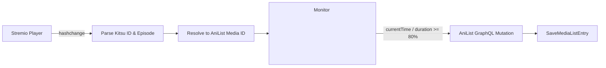

# AniListSync — Stremio Enhanced Plugin


**AniListSync** is an automated anime tracking plugin for [Stremio Enhanced](https://github.com/REVENGE977/stremio-enhanced) that seamlessly synchronizes your watched anime episodes with your [AniList](https://anilist.co) profile in real-time.

---

## ✨ Features

- **⚡ Automatic Episode Tracking:** Scrobbles watched episodes to AniList when you reach the configured playback threshold (80% by default).
- **🎯 Multi-tier ID Matching:**
  1. Local cache lookup (`localStorage`).
  2. Kitsu API integration to extract MyAnimeList (MAL) external mappings.
  3. Direct MAL ID matching on AniList for 100% accurate identification.
  4. Fuzzy title search fallback on AniList GraphQL API.
- **🙋 First Episode Confirmation:** Prompts with a native dialog (`showAlert`) asking if you want to add newly started anime to your list.
- **🏆 Auto-Completion:** Automatically marks the anime status as `COMPLETED` upon finishing the final episode.
- **⚙️ Native Settings Integration:** Configurable directly inside the Stremio Enhanced settings panel via `StremioEnhancedAPI`.
- **🛡️ Rate-Limit Resilient:** Fully respects AniList's 90 req/min API rate limits with automatic exponential backoff.
- **🚀 Automated CI/CD:** Ready for community marketplace distribution via GitHub Actions release workflows.

---

## 📥 Installation

1. Download the latest `AniListSync.plugin.js` from the [Releases](../../releases) tab.
2. Open **Stremio Enhanced**.
3. Go to **Settings** → **Plugins**.
4. Click **OPEN PLUGINS FOLDER**.
5. Move `AniListSync.plugin.js` into that directory.
6. Enable **AniListSync** in your plugins list.

---

## 🔑 AniList Authentication Setup

The plugin uses AniList's **OAuth2 Implicit Flow** to authenticate securely without storing your account password. Tokens are generated directly by AniList and remain valid for 1 year.

### Step 1: Create an AniList API Client (Takes 30 seconds)
1. Log in to [AniList](https://anilist.co) and go to **[AniList Developer Settings](https://anilist.co/settings/developer)**.
2. Click **Create New Client** (or **Create Developer App**).
3. Fill in the fields:
   - **Name:** `AniListSync` (or any name you prefer)
   - **Redirect URL:** `https://anilist.co/api/v2/oauth/pin`
4. Click **Save**.
5. Copy your numerical **Client ID** (e.g., `50001` or your generated ID).

---

### Step 2: Generate your Access Token
1. Open the following URL in your browser, replacing `<YOUR_CLIENT_ID>` with your Client ID:
   ```text
   https://anilist.co/api/v2/oauth/authorize?client_id=<YOUR_CLIENT_ID>&response_type=token
   ```
2. Click **Authorize** to grant list access.
3. AniList will display your long-lived `access_token` on the screen.
4. Copy the entire token string.

---

### Step 3: Connect with Stremio Enhanced
1. In **Stremio Enhanced**, go to **Settings** → **Plugins** → **AniListSync** (click the gear icon).
2. Paste your token into the **AniList Access Token** field.
3. The plugin will immediately validate your token and display `🟢 Connected as <your_username>`.
4. Click **Close** to save your settings.

## 🛠️ Plugin Settings

| Setting | Type | Default | Description |
| :--- | :--- | :--- | :--- |
| `AniList Access Token` | `input` | `""` | Your personal AniList OAuth access token |
| `AniList Username` | `input` | `Not connected` | Displays the authenticated user |
| `Ask to Add New Anime` | `toggle` | `true` | Prompts with a dialog before adding new series |
| `Auto-Complete Anime` | `toggle` | `true` | Marks anime as `COMPLETED` on the last episode |
| `Scrobble Threshold` | `select` | `80%` | Playback percentage required before scrobbling (50%, 70%, 80%, 90%) |

---

## 🧠 How It Works



1. **Playback Listener:** Listens for URL hash navigation (`#/player/...`) containing Kitsu metadata identifiers (`kitsu:ID:EP`).
2. **Resolution Engine:** Converts the Kitsu anime ID to an exact AniList `mediaId` using Kitsu's mapping endpoint and AniList's GraphQL API.
3. **Video Monitor:** Attaches a `timeupdate` listener to the active `<video>` DOM element. Once the playback time crosses the configured threshold, the scrobble payload is queued.
4. **List Mutation:** Dispatches a `SaveMediaListEntry` GraphQL mutation updating your episode progress.

---

## 💻 Development & Building

This project is built using [TypeScript](https://www.typescriptlang.org/) and bundled with [Bun](https://bun.sh).

### Prerequisites

- [Bun](https://bun.sh) (v1.0 or higher)

### Build Steps

```bash
# Install dependencies
bun install

# Compile into single plugin file with required metadata banner
bun run build
```

The output file will be generated at `dist/AniListSync.plugin.js`.

---

## 🏷️ Automated Releases (CI/CD)

This repository includes a GitHub Actions workflow (`.github/workflows/release.yml`). To create a new release:

```bash
git tag v1.0.0
git push origin v1.0.0
```

The workflow will automatically compile the TypeScript source code with Bun and publish a GitHub Release with the bundled `AniListSync.plugin.js` asset attached.

---

## 👤 Author

**GefyDev**
- **Website:** [gefy.dev](https://gefy.dev)
- **Contact:** [hi@gefy.dev](mailto:hi@gefy.dev)
- **GitHub:** [@GefyDev](https://github.com/GefyDev)

---

## 📄 License

This project is open source and available under the [MIT License](LICENSE).
